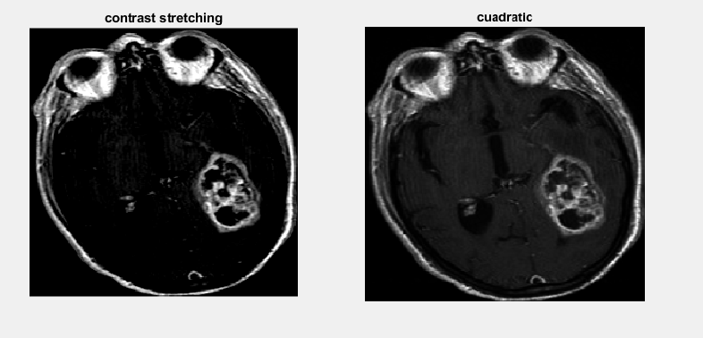
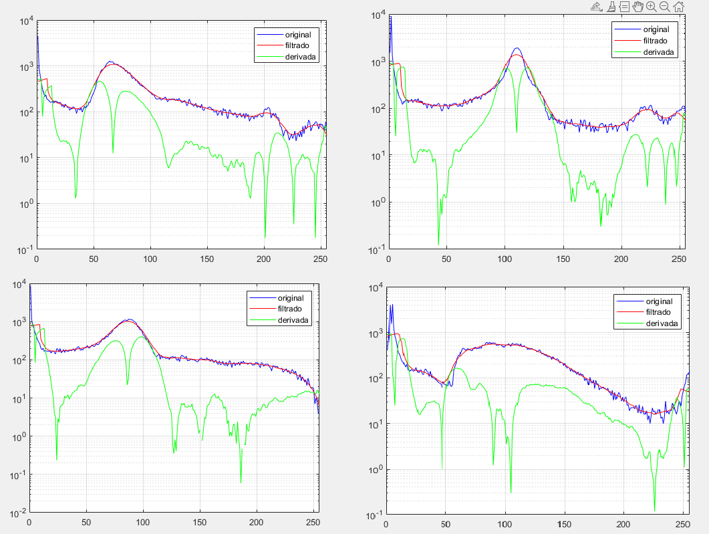
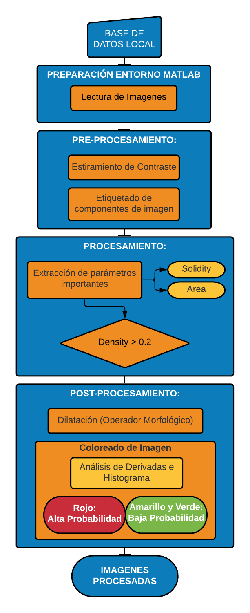
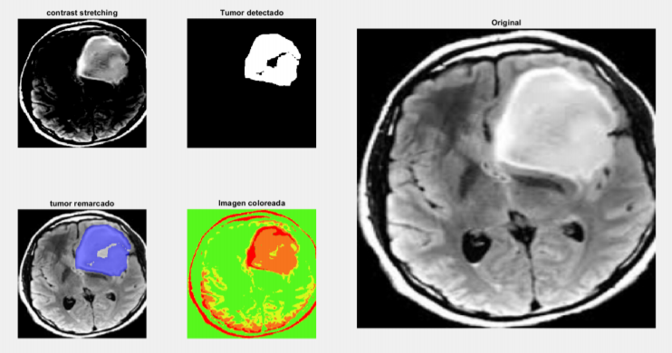
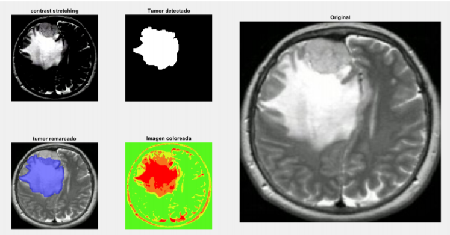
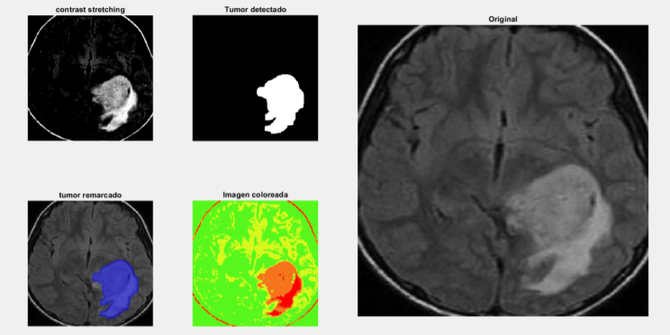
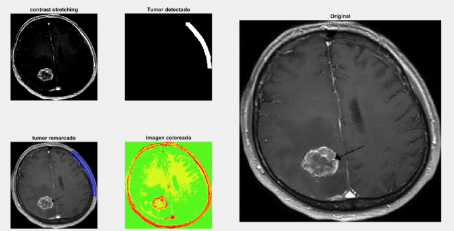
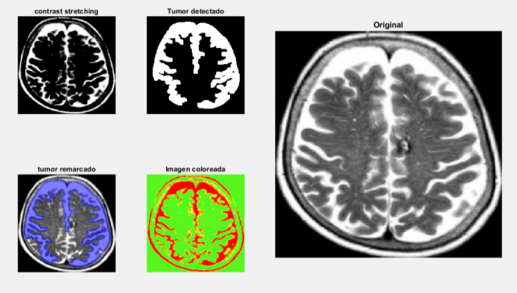

# Universidad Católica Boliviana “San Pablo”

## Integrantes:

### Christian Conchari Cabrera

### Manuel Ignacio Uzquiano Uzquiano

***Reporte del proyecto***

***Detección de tumores***

##  **Abstracto**

El objetivo del proyecto fue el desarrollo de un programa en matlab que identifique tumores cerebrales en imágenes de resonancia magnética. 
Se realizó comenzando por una etapa de pre-procesamiento, utilizando una etapa de filtrado y mejoramiento de contraste con “contrast stretching” para tener una mejor imagen de entrada, la cual serviría mucho para la siguiente etapa de procesamiento, donde se utilizaron tanto aérea como densidad para determinar las zonas más probables a ser un tumor, la unión de estos ambos dio el resultado final. 
Finalmente, como post-procesamiento se utilizó una función de coloreado complementaria al proceso original para su determinación en ciertos casos o ayuda al operador. Se logró su aplicación en las imágenes de la base de datos independientemente de su tipo o forma con un gran rango de acertación.

**&lt;tumor, contraste, detección, resonancia magnética, función &gt;**

##  **Desarrollo**

La funcionalidad del código implementado puede dividirse en 6 bloques:
1. El primer bloque lee la imagen desde un directorio externo y la prepara el entorno de matlab para su uso recurrente en cada imagen.
2. En el segundo bloque se realizan operaciones en la imagen para su manipulación, primeramente es el mejoramiento de contraste de zonas que resalten, es decir, impulsar el histograma a los extremos más que al medio, lo cual puede verse como un método de mejoramiento de contraste. El proceso en este tipo de imágenes al ser muy “oscuras” es bastante similar al de el mejoramiento de imágenes oscuras por el método cuadrático (figura 1), aunque se decidio por la propia función del matlab “contrast stretching” ya que se podía manipularse sus parámetros más fácilmente. Esto se realizó para que la discriminación por “im2bw” sea mejor y finalmente volver esos valores binarios a double con “bwlabel”. Los parámetros de mayor interés en el proyecto fueron el rango de stretchlim y el complemento de im2bw.
3. El tercer bloque se enfoca en el análisis, la función “regionprops” nos proporciona parámetros de la imagen necesarios, como “Solidity” y “Area”; del primero se lo extrae y busca el que tenga un valor > 0.2 para que no tome regiones equivocadas, y se elige el área mayor de la zona con alta densidad con el primer parámetro. Hallando esta área y que coincida con el de mayor densidad, se extrae una imagen restrictiva que marque la zona seleccionada de los parámetros con 1 y el resto con 0.
4. El cuarto bloque es el post procesamiento, se utilizó la función “imdilate” con un strel ya definido para mejorar su zona de detección, esto debido a que los tumores pueden ser huecos en algunos casos o de forma impredecible.
5. En el quinto bloque se realizó un coloreado a las imágenes con el propósito de darle al usuario una mejor lectura en casos impredecibles, ya que el programa detecta un único tumor, es probable que haya varios o indicios de otros problemas como cisticercosis cerebral. Los valores utilizados para el coloreado fueron dados mediante un promedio de los cambios abruptos mediante el análisis de histograma y sus derivadas que mostraron estos cambios. (figura 2.) se utilizaron colores muy contrastantes como rojo mayor posibilidad de tumor y verde o amarillo ausencia o tejido normal.
6. La sexta parte se enfoca en graficar las imágenes importantes y el tumor detectado tanto por el programa, como por la ayuda de colores. El programa superpone el tumor sobre la imagen original con el uso del comando “labeloverlay” y puede ser notado de color azul.

***Figura 1. Comparación de los resultados mediante (izquierda) el
mejoramiento de imágenes oscuras con el método cuadrático ((IM.\^2)/255)
mientras que a la derecha, con la función de matlab con parámetros
fijados de (\[0.65 0.99\]).***

!

***Figura 2. Comparación del análisis de cambios mediante la derivada de
las imágenes 5,55,35 y 65 de las cuales se puede observar un
comportamiento bastante similar, pese a ser totalmente distintas, pero
coinciden en valores muy bajos, en valores de 90,100 y uno más en
valores aprox. 200 de donde se sacó la información para el coloreado.***

##  **Pruebas de funcionamiento**
A continuación se presentará un conjunto de imágenes donde las tres primeras muestran un funcionamiento correcto y las dos últimas muestran los problemas que se llegaron a tener al desarrollar el programa.

Se comienza presentando la siguiente imagen donde se puede ver claramente la segmentación realizada en el turno encontrado (tumor remarcado) y de igual manera se ver que el coloreado de la imagen se hizo adecuadamente quedando como región roja la región correspondiente al tumor.

De igual forma la siguiente imagen sirve como muestra de un funcionamiento correcto, siendo que se pueden ver la segmentación del tumor y el coloreado corresopndiente.

Veamos ahora el siguiente caso donde podemos ver que la segmentación de color no se hizo adecuadamente, esto se debe principalmente a que los bordes del craneo llegarón a ocupar una alta densidad en la imagen, dicho de otra manera, llegarón a tener más densidad que el propio tumor, y por lo tanto no se pudo hacer la detección de manera exitosa.

En la siguiente imagen de igual forma podemos ver que la detección no se hizo de manera adecuada, esto se debe a que la imagen MRI fue tomada utilizando un medio de contraste, como podría ser Gadolinio, lo cual hace que los bordes sean mucho más brillantes que otras secciones del cerebro, por lo tanto, al momento de hacer el procesamiento, estos bordes quedan con una densidad mayor a la del tumor y consecuentemente no se hace la detección de este. 

Con las imágenes recién mostradas podemos ver que el funcionamiento del programa es el correcto, para evidenciar este hecho se desarrolló la siguiente tabla donde se muestran la cantidad de imágenes con las que se probó y si el programa logró detectar un tumor de manera adecuada.

| **Imagen** | **Reultado** | **codigo de error** | **Imagen** | **Reultado** | **codigo de error**  |
| ---------- | ------------ | ------------------- | ---------- | ------------ | -------------------- |
| 1          | Funciona     |                     | 73         | Funciona     |                      |
| 2          | Funciona     |                     | 74         | Funciona     |                      |
| 3          | Funciona     |                     | 75         | Funciona     | ruido de fondo       |
| 4          | Funciona     |                     | 76         | Funciona     |                      |
| 5          | Funciona     | varias figuras      | 79         | Funciona     |                      |
| 7          | Funciona     |                     | 84         | Funciona     |                      |
| 11         | Funciona     |                     | 86         | Funciona     |                      |
| 13         | Funciona     |                     | 28         | Funciona     |                      |
| 14         | Funciona     |                     | 29         | Funciona     |                      |
| 15         | Funciona     | varias figuras      | 30         | Funciona     |                      |
| 17         | Funciona     |                     | 35         | Funciona     | varias figuras       |
| 18         | Funciona     |                     | 8          | NO funciona  | contraste inadecuado |
| 19         | Funciona     | varias figuras      | 9          | NO funciona  | ruido de fondo       |
| 21         | Funciona     |                     | 10         | NO funciona  | contraste inadecuado |
| 22         | Funciona     |                     | 20         | NO funciona  | ruido de fondo       |
| 23         | Funciona     |                     | 31         | NO funciona  | varias figuras       |
| 24         | Funciona     |                     | 32         | NO funciona  | varias figuras       |
| 26         | Funciona     |                     | 36         | NO funciona  | contraste inadecuado |
| 27         | Funciona     |                     | 38         | NO funciona  | contraste inadecuado |
| 33         | Funciona     |                     | 46         | NO funciona  | varias figuras       |
| 34         | Funciona     |                     | 53         | NO funciona  | contraste inadecuado |
| 37         | Funciona     |                     | 56         | NO funciona  | contraste inadecuado |
| 39         | Funciona     |                     | 64         | NO funciona  | varias figuras       |
| 40         | Funciona     |                     | 71         | NO funciona  | ruido de fondo       |
| 41         | Funciona     |                     | 77         | NO funciona  | varias figuras       |
| 42         | Funciona     |                     | 81         | NO funciona  | contraste inadecuado |
| 44         | Funciona     |                     | 82         | NO funciona  | contraste inadecuado |
| 45         | Funciona     |                     | 83         | NO funciona  | contraste inadecuado |
| 47         | Funciona     |                     | 85         | NO funciona  | varias figuras       |
| 48         | Funciona     |                     | 70         | NO funciona  | varias figuras       |
| 49         | Funciona     |                     | 6          | Parcial      |                      |
| 52         | Funciona     |                     | 12         | Parcial      |                      |
| 55         | Funciona     |                     | 16         | Parcial      |                      |
| 59         | Funciona     |                     | 25         | Parcial      | ruido de fondo       |
| 61         | Funciona     |                     | 43         | Parcial      | varias figuras       |
| 62         | Funciona     |                     | 50         | Parcial      | ruido de fondo       |
| 63         | Funciona     |                     | 51         | Parcial      | ruido de fondo       |
| 65         | Funciona     |                     | 54         | parcial      |                      |
| 66         | Funciona     |                     | 58         | Parcial      | varias figuras       |
| 67         | Funciona     |                     | 60         | Parcial      | varias figuras       |
| 68         | Funciona     |                     | 78         | Parcial      | ruido de fondo       |
| 69         | Funciona     |                     | 80         | Parcial      | ruido de fondo       |
| 72         | Funciona     |                     | 57         | Parcial      | contraste inadecuado |

##  **Conclusiones**
Como se ha podido evidenciar en la sección anterior, el programa desarrollado es completamente funcional y cunple de manera adecuada con la tarea para la cual ha sido desarrollado, en este caso es la detección de tumores cerebrales mediante imágenes de MRI. 
Tomando en cuenta los resultados obtenidos, si bien existen imágenes en las cuales no se obtiene el resultado deseado o esperado, esto se debe principalmente a la imagen en sí y la forma en la que estamos procesándola, pues como se mencionó anteriormente, trabajamos principalmente con las densidades de elementos en la imagen para generar máscaras y finalmente separar lo que vendría a identificarse como un tumor, en el caso de una imagen que presente ruido, como ser otros elementos que presenten alta densidad y no sean necesariamente tumores, un ejemplo pueden ser los ojos del paciente, el programa puede llegar a confundir estos elementos de alta densidad con un tumor. Para mejorarse estos aspectos podrían incluirse más etapas de pre-procesamiento para agrupar imágenes con ciertas características y procesarlas de manera diferente de acuerdo a estas, con el fin de dar mejores resultados. Dejando esto de lado, en la mayoría de los casos la detección del tumor es exitosa, por lo que se podría decir que aun con los problemas generados el proyecto se realizó correctamente.

El presente trabajo podría continuarse con la antes mencionada adición de más casos de procesamiento e incluso incrementando el dataset de pruebas para tener más variabilidad entre imágenes y conocer más de los diferentes casos que pueden llegar a entrar a nuestro programa. Yendo un paso más allá se podría plantear el uso de herramientas de Deep Learning para clasificar las imágenes en dos clases [tumor, no-tumor], para ello se analizaría entre utilizar la arquitectura ResNet18 mediante Transfer Learning o el modelo YOLO para detección de objetos.

## Referencias
- Buscar límites para contrastar la imagen de estiramiento - MATLAB stretchlim - MathWorks América Latina. (s. f.). Mathworks. Recuperado 5 de junio de 2021, de https://la.mathworks.com/help/images/ref/stretchlim.html
- Dilatar imagen - MATLAB imdilate - MathWorks América Latina. (s. f.). Mathworks. Recuperado 5 de junio de 2021, de https://la.mathworks.com/help/images/ref/imdilate.html
- Etiquetar componentes conectados en imagen binaria 2D - MATLAB bwlabel - MathWorks América Latina. (s. f.). Mathworks. Recuperado 5 de junio de 2021, de https://la.mathworks.com/help/images/ref/bwlabel.html
- Medir las propiedades de las regiones de imagen - MATLAB regionprops - MathWorks América Latina. (s. f.). Mathworks. Recuperado 5 de junio de 2021, de https://la.mathworks.com/help/images/ref/regionprops.html
- GEEK LEAK. (2016, 23 febrero). Brain Tumor Detection using Matlab - Image Processing + GUI step by step [Vídeo]. YouTube. https://www.youtube.com/watch?v=UeFRo7uALhM&t=400s