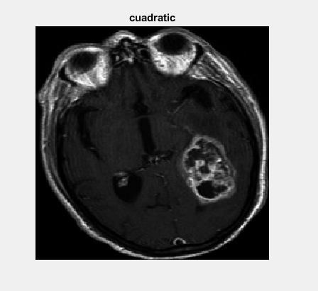
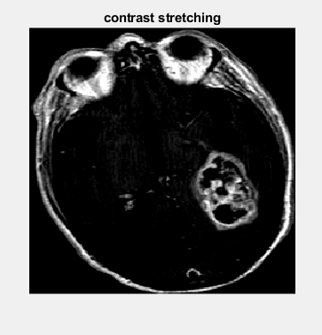
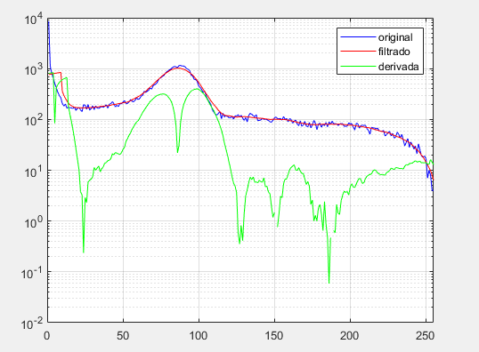
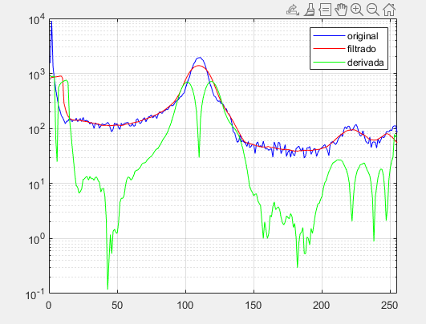
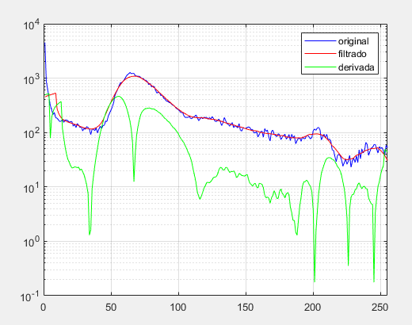
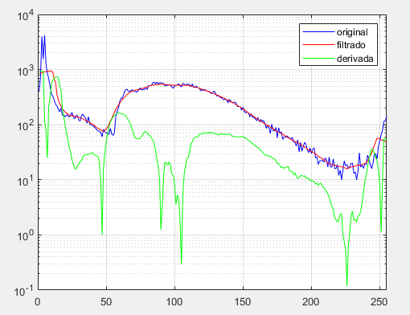

Universidad Católica Boliviana “San Pablo”

Integrantes:

Christian LolimasterYT Conchari Cabrera

Manuel Ignacio Uzquiano Uzquiano

Fecha: 5 de junio de 2021

***Reporte del proyecto***

***Detección de tumores***

1.  **Abstracto**

El objetivo del proyecto fue el desarrollo de un programa en matlab que
identifique tumores cerebrales en imágenes de resonancia magnética.

Se realizó utilizando una etapa de filtrado y mejoramiento de contraste
con “contrast stretching” para tener una mejor imagen de entrada, en la
etapa de procesamiento se utilizaron tanto aérea como densidad para
determinar las zonas más probables a ser un tumor, la unión de estos
ambos dio el resultado final. Finalmente se utilizó una función de
coloreado complementaria al proceso original para su determinación en
ciertos casos o ayuda al operador.

Se logró su aplicación en las imágenes de la base de datos
independientemente de su tipo o forma con un gran rango de acertación.

**&lt;tumor, contraste, detección, resonancia magnética, función &gt;**

1.  **Desarrollo **

El código puede ser dividido en 6 bloques para su funcionamiento.

-   El primer bloque lee la imagen desde una carpeta externa y prepara
    > el entorno de matlab para su uso recurrente en cada imagen.

-   En el segundo bloque se realizan operaciones en la imagen para su
    > manipulación, primeramente es el mejoramiento de contraste de
    > zonas que resalten, osea impulsar el histograma a los extremos más
    > que al medio. El proceso en este tipo de imágenes al ser muy
    > “oscuras” es bastante similar al de el mejoramiento de imágenes
    > oscuras por el método cuadrático (figura 1), aunque se decantó por
    > la propia función del matlab “contrast stretching” ya que se podía
    > manipularse sus parámetros más fácilmente. Esto se realizó para
    > que la discriminación por “im2bw” sea mejor y finalmente volver
    > esos valores binarios a double con “bwlabel”. Los parámetros de
    > mayor interés en el proyecto fueron el rango de stretchlim y el
    > complemento de im2bw.

-   El tercer bloque se enfoca en el análisis, la función “regionprops”
    > nos proporciona parámetros de la imagen necesarios, como
    > “Solidity” y “Area”; del primero se lo extrae y busca el que tenga
    > un valor &gt; 0.2 para que no tome regiones equivocadas, y se
    > elige el área mayor de la zona con alta densidad con el
    > primer parámetro. Hallando esta área y que coincida con el de
    > mayor densidad, se extrae una imagen restrictiva que marque la
    > zona seleccionada de los parámetros con 1 y el resto con 0.

-   El cuarto bloque es el post procesamiento, se utilizó la función
    > “imdilate” con un strel ya definido para mejorar su zona de
    > detección con “imdilate”, esto debido a que los tumores pueden ser
    > huecos en algunos casos o de forma impredecible.

-   En el quinto bloque se realizó un coloreado a las imágenes con el
    > propósito de darle al usuario una mejor lectura en casos
    > impredecibles, ya que el programa detecta un único tumor, es
    > probable que haya varios o indicios de otros problemas como
    > cisticercosis cerebral (figura xxxxxxx). Los valores utilizados
    > para el coloreado fueron dados mediante un promedio de los cambios
    > abruptos mediante el análisis de histograma y sus derivadas que
    > mostraron estos cambios. (figura 2.) se utilizaron colores muy
    > contrastantes como rojo mayor posibilidad de tumor y verde o
    > amarillo ausencia o tejido normal.

-   La sexta parte se enfoca en graficar las imágenes importantes y el
    > tumor detectado tanto por el programa, como por la ayuda
    > de colores. El programa superpone el tumor sobre la imagen
    > original con el uso del comando “labeloverlay” y puede ser notado
    > de color azul.

{width="2.3794739720034994in"
height="2.172134733158355in"}{width="2.1093755468066493in"
height="2.1854866579177603in"}

***Figura 1. Comparación de los resultados mediante (izquierda) el
mejoramiento de imágenes oscuras con el método cuadrático ((IM.\^2)/255)
mientras que a la derecha, con la función de matlab con parámetros
fijados de (\[0.65 0.99\]).***

{width="2.110932852143482in"
height="1.5537729658792652in"}{width="2.066836176727909in"
height="1.5703904199475065in"}

{width="2.1473917322834644in"
height="1.7027296587926508in"}{width="2.121583552055993in"
height="1.6193733595800526in"}

***Figura 2. Comparación del análisis de cambios mediante la derivada de
las imágenes 5,55,35 y 65 de las cuales se puede observar un
comportamiento bastante similar, pese a ser totalmente distintas, pero
coinciden en valores muy bajos, en valores de 90,100 y uno más en
valores aprox. 200 de donde se sacó la información para el coloreado.***

1.  **Pruebas de funcionamiento**

2.  **Conclusiones**
